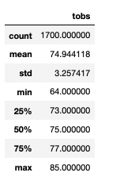
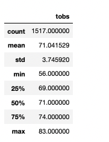

# surfs_up
## Overview
A few intro sentences about the purpose of this analysis

## Process 
SQLite provided weather data: includes: X, Y, Z.. Jupyter notebooks to create queries with SQLAlchemy to understand:
Convert data to DataFrame with Pandas. Simple statistics with the .describe function. 

## Output

June Weather Data

December Weather Data

## Results
Key Differences in weather between June and December
- Major Point 1
- Major Point 2
- Major Point 3

## Summary
High Level Summary 
Two additional queries that could gather more weather data for June and December 
